大家好，我是鹤仙人，专注AI大模型和个人开发。

今天教大家如何在5分钟内，利用大模型，开发chrome划词翻译插件。

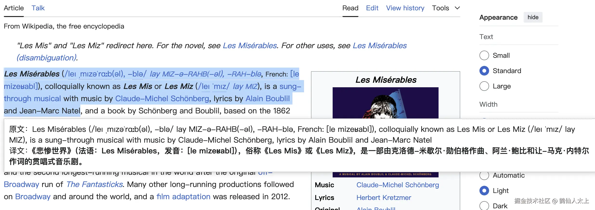

接下来我会分享教程，大家只需要花几分钟的时间，就能快速做出同款AI应用。

## 引言

大模型热度很高，不少小伙伴跟我一样想用大模型做一些有意思且有用的应用。对于外语不好的同学，阅读文章时可能会有点吃力，所以我今天花了30分钟用大模型写代码开发了一款chrome划词翻译插件“Wipe”。

## 插件制作教程

### 一、启动插件

#### 下载源码

从github下载源码，插件源码：<https://github.com/furioussoul/wipe>

#### 加载插件

**点击浏览器右上角 `“自定义及控制 Google Chrome ”`**

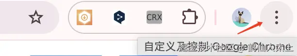

**点击扩展程序**

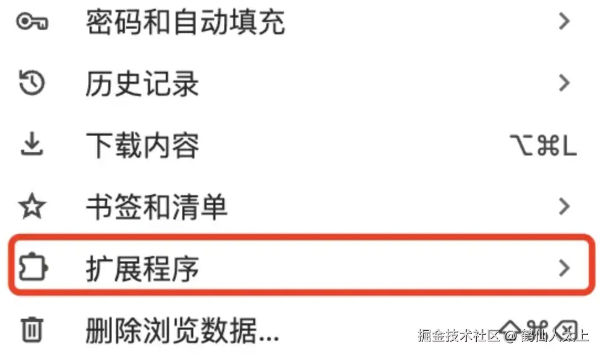

**点击管理扩展程序**

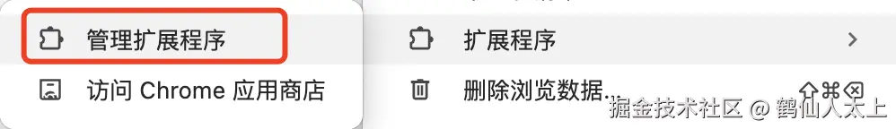

**打开开发者模式->加载wipe源码->完成启动！**

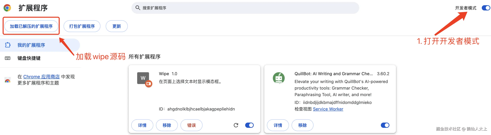

**出现这个icon图标就表示插件启动成功了**
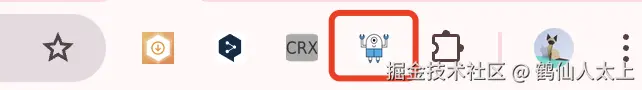

**打开或刷新英文网页，选中文本开始翻译！**
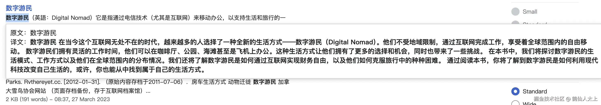

### 二、插件文件目录

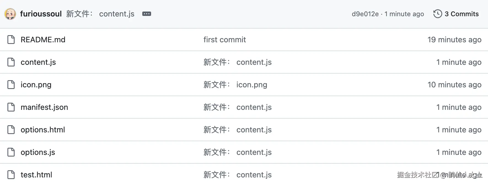

Chrome 插件（扩展程序）通常由多个文件组成，每个文件都有其特定的作用。以下是wipe文件及其作用介绍：

1.  **manifest.json**：
    *   这是每个 Chrome 扩展程序必备的文件，定义了扩展的元数据，包括名称、版本、描述、权限、背景脚本、内容脚本等。
    *   它是扩展的配置文件，指示浏览器如何加载和使用扩展。

2.  **content.js**：
    *   内容脚本是在特定网页上执行的脚本，通常用于修改网页内容或与网页进行交互。
    *   它们在指定的网页上下文中运行，并且可以与网页的 DOM 直接交互。

3.  **options.html / options.js**：
    *   用于扩展的选项页面，让用户配置扩展的设置。
    *   `options.html` 定义了选项页面的布局和样式，`options.js` 实现选项的交互逻辑。

实际上chrome插件还支持其他更多的不同作用的文件类型，如**styles.css、background.js**等，具体需要使用哪些类型文件取决于插件功能和开发者的实现方式。

### 三、编写提示词

#### 英文翻译为中文的提示词

```英文翻译为中文
#  Role: 翻译专家 : 专注于英文翻译，确保准确性和专业性，同时符合中文表达习惯。
## Goals
准确、专业地将英文书籍翻译成中文，保持原意，符合中文表达习惯。
            
## Constrains
必须保持原意，同时符合中文表达习惯。
            
## Skills
英文到中文的专业翻译能力，理解并保持原意，熟悉中文表达习惯。
            
## Output format
提供准确、专业的中文翻译文本。
            
## Workflow:
1. 仔细阅读并理解<内容>"${word}"</内容>。
2. 对以上内容进行翻译，确保准确性和专业性。
3. 校对翻译文本，确保符合中文表达习惯。
4. 只输出最终翻译文本。
```

#### 文言文翻译的提示词

```文言文翻译
#  Role: 翻译专家 : 专注于文言文翻译，确保准确性和专业性，同时符合现代中文表达习惯。

## Goals
准确、专业地将文言文书籍翻译成现代中文，保持原意，符合现代中文表达习惯。

## Constrains
必须保持原意，同时符合现代中文表达习惯。

## Skills
文言文到现代中文的专业翻译能力，理解并保持原意，熟悉现代中文表达习惯。

## Output format
提供准确、专业的文言文翻译文本。

## Workflow:
1. 仔细阅读并理解<内容>"${word}"</内容>。
2. 对以上内容进行翻译，确保准确性和专业性。
3. 校对翻译文本，确保符合现代中文表达习惯。
4. 只输出最终翻译文本。
```

### 四、免费获取GLM大模型apiKey

登录官网<https://bigmodel.cn/> 注册获取免费apiKey
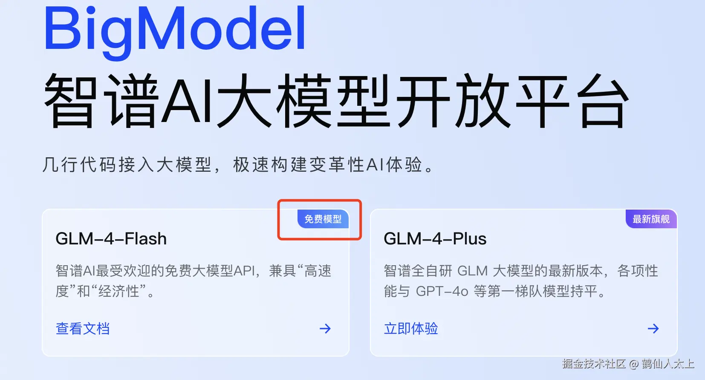

密钥地址：<https://bigmodel.cn/usercenter/apikeys> 需先注册
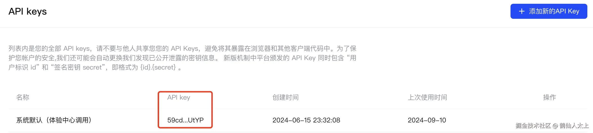

### 五、插件配置

#### 配置页面

**点击浏览器右上角选项进入插件配置页面**


#### 配置插件

配置大模型GLM apiKey和提示词，`注意不要删除占位符"${word}"，它是翻译时的原文`
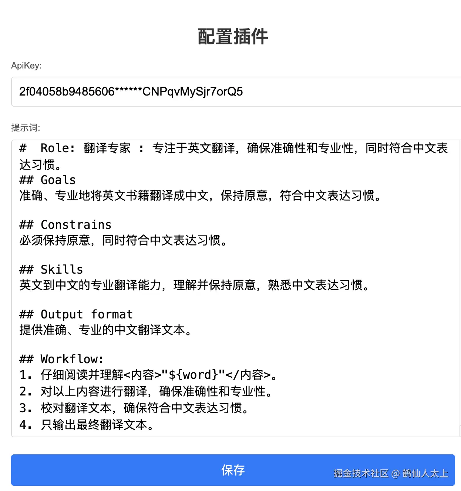

#### 翻译效果

英译中


文言文
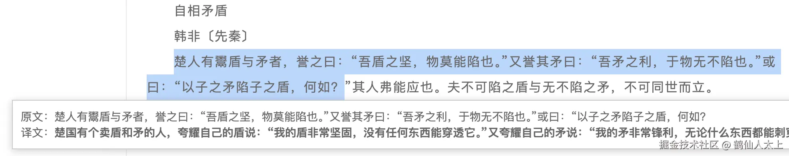

## 最后

通过这个教程，我相信大家不仅学到了如何制作chrome浏览器翻译插件，还学会了开发大模型原生AI应用，希望对大家有帮助，大家都能做出自己的AI应用来提升技能和效率。

学会的话点赞收藏支持下啦，谢谢大家\~